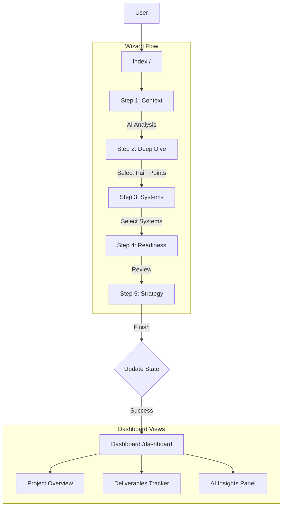
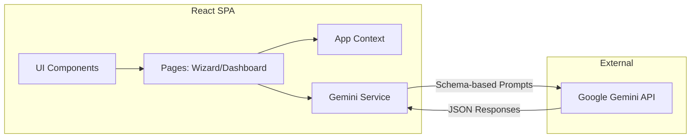

# Sun AI Agency Platform - Application Overview

## 1. Tech Stack & Dependencies

The application is built as a client-side Single Page Application (SPA) using modern React and ES Modules.

| Category | Technology | Version (Approx) | Description |
|----------|------------|------------------|-------------|
| **Framework** | React | ^19.2.3 | Core UI library |
| **Routing** | React Router DOM | ^7.11.0 | Client-side routing (HashRouter) |
| **Styling** | Tailwind CSS | CDN | Utility-first CSS framework (configured in `index.html`) |
| **Icons** | Lucide React | ^0.562.0 | Iconography library |
| **AI SDK** | @google/genai | ^1.34.0 | Google Gemini API Client |
| **Language** | TypeScript | - | Static typing (transpiled) |

## 2. Directory Structure

The project follows a flat, feature-based structure rooted in the main directory.

```
/
├── index.html                  # Entry HTML, importmaps, Tailwind config
├── index.tsx                   # React DOM Entry point
├── App.tsx                     # Main Component, Router, & Context Provider
├── types.ts                    # Global TypeScript interfaces & state definitions
├── metadata.json               # Application metadata/permissions
├── components/
│   └── ui.tsx                  # Reusable UI primitives (Button, Card, Input, etc.)
├── pages/
│   ├── Wizard.tsx              # 5-Step Onboarding Wizard Logic & UI
│   └── Dashboard.tsx           # Post-onboarding Executive Dashboard
└── services/
    └── geminiService.ts        # AI Service layer wrapping Google GenAI SDK
```

## 3. Routing & Navigation

The application uses `HashRouter` for routing to ensure compatibility across various static hosting environments.

| Path | Component | Access Control | Description |
|------|-----------|----------------|-------------|
| `/` | `Wizard` | Public | Entry point. Handles business analysis and strategy generation. |
| `/dashboard` | `Dashboard` | Protected | accessible only `hasCompletedWizard` is true in global state. Redirects to `/` otherwise. |

**Protection Logic:**
Implemented in `App.tsx` via conditional rendering:
```tsx
element={appState.hasCompletedWizard ? <Dashboard /> : <Navigate to="/" replace />}
```

## 4. State Management

A lightweight global state is managed via React Context (`AppContext`) in `App.tsx`.

**State Schema (`AppState` in `types.ts`):**
- `step`: Current wizard step.
- `profile`: User business details (Company Name, Industry, etc.).
- `analysis`: AI-generated business analysis.
- `selectedBottlenecks`: User's identified pain points.
- `selectedSystems`: Chosen strategic systems.
- `readiness`: AI-calculated readiness score and gaps.
- `strategy`: Final generated 3-phase execution plan.

## 5. Workflows

### Onboarding Wizard (The "Sun AI Setup")
The core value prop is the AI-driven consulting wizard. It consists of 5 sequential steps:

1.  **Business Context**: User inputs company details. -> **AI Action**: `analyzeBusiness` (Identifies Industry/Model).
2.  **Industry Deep Dive**: User answers dynamic bottleneck questions. -> **AI Action**: `generateQuestions`.
3.  **System Selection**: User selects 3 key systems based on bottlenecks. -> **AI Action**: `recommendSystems`.
4.  **Readiness Assessment**: Review score/gaps. -> **AI Action**: `assessReadiness`.
5.  **Strategy & Phases**: Review 3-phase roadmap. -> **AI Action**: `generateStrategy`.

**Completion**: Triggers `handleFinish`, sets `hasCompletedWizard = true`, navigates to `/dashboard`.

### Client Dashboard
A 3-column layout (Context, Work Surface, Intelligence) displaying the generated strategy, deliverables, and persistent AI insights.

## 6. Architecture Diagrams

### Sitemap & User Flow


### Application Architecture


## 7. Import Paths & Libraries
*Defined in `index.html` via `importmap`*

- **React ecosystem**: Loaded via `esm.sh`
- **UI Components**: Custom built in `components/ui.tsx` using Tailwind classes.
- **Icons**: `lucide-react` loaded via `esm.sh`.
