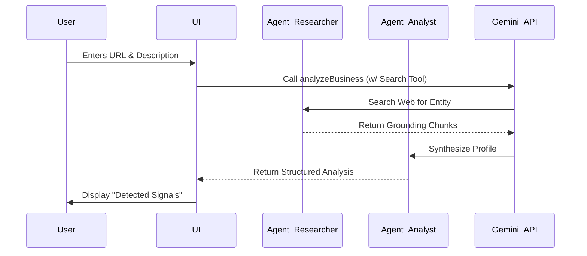
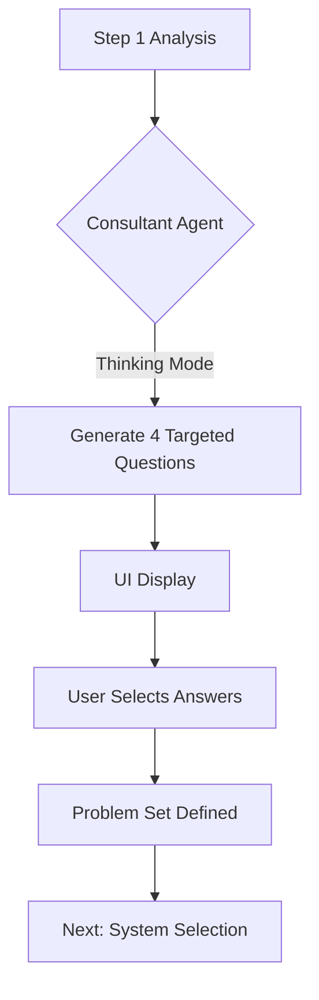
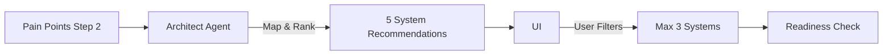
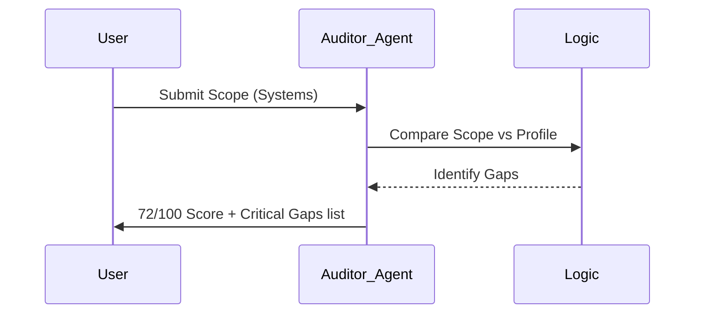

```mermaid
gantt
    title Generated Roadmap Structure
    dateFormat  X
    axisFormat %w
    section Phase 1
    Foundation :active,  0, 4
    section Phase 2
    Growth Engine : 4, 8
    section Phase 3
    Optimization : 8, 12
```

# Sun AI Agency Wizard - Audit & Architecture

**Product:** Sun AI Agency Platform  
**Module:** Onboarding Wizard (Core Setup)  
**Version:** 1.0  
**Auditor:** Senior Product Architect

---

## OBJECTIVE

The Sun AI Wizard is a **consultative intelligence engine**. Unlike standard forms that just collect data, this wizard uses active AI reasoning to:
1.  **Analyze** the business reality in real-time.
2.  **Diagnose** specific operational bottlenecks.
3.  **Prescribe** a tailored systems architecture.
4.  **Plan** a 90-day execution roadmap.

This document breaks down the logic, AI agents, and value flow for each of the 5 core screens.

---

## Screen 1 — Business Context

### 1. Purpose (Business View)
To establish a "Data Foundation" for the AI. This screen replaces the need for a human consultant to spend hours researching a new lead. It instantly verifies the company's existence, classifies its business model (e.g., B2B vs B2C), and assesses its digital maturity using live web data.

### 2. UI Layout
*   **Main Panel:** A clean form collecting Identity (Name, Company), Web Presence (URL), and Self-Described Challenges.
*   **Right AI Panel:** "Live Research Feed". As the AI processes, it shows:
    *   Detected Industry Context
    *   Business Model Inference (B2B/B2C)
    *   Digital Maturity Signals
    *   Key Observations (e.g., "High SKU count detected")

### 3. Gemini 3 Features & Tools Used
*   **Google Search Grounding:** actively searches the provided URL/Company Name to verify existence and scrape public context.
*   **Thinking Mode:** Used to reason through conflicting signals (e.g., a company that looks B2C but sells wholesale) to determine the primary business model.
*   **Structured JSON Output:** Forces the analysis into a strict schema (`BusinessAnalysis`) for downstream logic.

### 4. AI Agents Involved
*   **The Researcher (Agent A):** Responsible for external verification. It "Googles" the client to prove they are real and active.
*   **The Analyst (Agent B):** Synthesizes the user's manual description with the Researcher's findings to create a "Truth Profile".

### 5. Automations & Logic
*   **Trigger:** User clicks "Analyze Business".
*   **Process:**
    1.  API call with `googleSearch` tool enabled.
    2.  Model verifies URL validity and content.
    3.  Model infers `digitalReadiness` based on web signals.
*   **Output:** A locked `BusinessAnalysis` object that feeds the context for *all* future questions.

### 6. Mermaid Diagram

### 7. Summary Table

| Item | Description |
|-----|-------------|
| **Core Features** | Real-time URL analysis, Google Search Grounding. |
| **Business Use Cases** | Lead qualification, instant trust-building ("It knows who I am"). |
| **Real-World Examples** | Detecting a client is "SaaS" even if they didn't say it. |
| **AI Agents Used** | Researcher, Analyst. |
| **Business Outcome** | A verified, structured profile to base all advice on. |

---

## Screen 2 — Industry Deep Dive

### 1. Purpose (Business View)
To move from generic advice to specific diagnosis. Instead of asking "What are your problems?", the AI acts as a **Senior Consultant**, asking highly specific questions relevant *only* to that industry. This proves expertise and uncovers the "Money Problems" (Revenue, Cost, Time).

### 2. UI Layout
*   **Main Panel:** 4 Targeted Questions (Business Focus, Operational Friction, Speed, Priority).
*   **Right AI Panel:** "Consultant's Logic". Explains *why* these specific questions were generated based on the Step 1 analysis (e.g., "Asking about returns because you are in Fashion Retail").

### 3. Gemini 3 Features & Tools Used
*   **Thinking Mode:** Critical here. The model must "think" like a consultant to generate questions that sound human, professional, and relevant, avoiding generic "AI fluff".
*   **Context Injection:** Uses the `BusinessAnalysis` object from Step 1 to tailor the options (e.g., "Inventory issues" for Retail vs "Lead quality" for SaaS).

### 4. AI Agents Involved
*   **The Consultant (Agent C):** Designed to simulate a Discovery Call. Its goal is to extract the *highest value problem* to solve.

### 5. Automations & Logic
*   **Input:** Industry + Business Model + Description.
*   **Generation:** Creates 4 unique `BottleneckQuestion` objects.
*   **User Action:** User selects answers (Single/Multi-select).
*   **Logic:** Answers are stored as the "Problem Set" used to query the System database in Step 3.

### 6. Mermaid Diagram

### 7. Summary Table

| Item | Description |
|-----|-------------|
| **Core Features** | Dynamic Question Generation, Industry-Specific Context. |
| **Business Use Cases** | Discovery call automation, pain point validation. |
| **Real-World Examples** | Asking a Law Firm about "Billable Hours" vs asking an E-com store about "Stockouts". |
| **AI Agents Used** | Consultant. |
| **Business Outcome** | Confirmed list of high-value bottlenecks. |

---

## Screen 3 — System Selection

### 1. Purpose (Business View)
To switch from "Problems" to "Solutions". This screen prescribes the **Architecture**. It avoids "Tool Shopping" (e.g., "Buy HubSpot") and focuses on "Systems" (e.g., "Lead Growth System"). It forces focus by limiting selection to 3 priority systems.

### 2. UI Layout
*   **Main Panel:** Grid of 5-6 System Cards. 2-3 are marked "Recommended". Users can toggle selection (Max 3).
*   **Right AI Panel:** "Solution Logic". Explains why specific systems were recommended based on the answers in Step 2.

### 3. Gemini 3 Features & Tools Used
*   **Reasoning/Mapping:** The model maps {Problem: "Manual data entry"} -> {Solution: "Operations Automation System"}.
*   **Structured Output:** Returns `SystemRecommendation` objects with clear titles, benefits, and category tags.

### 4. AI Agents Involved
*   **The Solutions Architect (Agent D):** Maps pain points to technical capabilities. It prioritizes "Time to Value" (Quick Wins) over massive infrastructure projects.

### 5. Automations & Logic
*   **Input:** Answers from Step 2.
*   **Process:** AI generates a list of 5 possible systems, ranking them by relevance.
*   **Constraint:** UI enforces a hard limit of 3 selections to prevent scope creep.
*   **Output:** User approves a `SelectedSystems` array.

### 6. Mermaid Diagram

### 7. Summary Table

| Item | Description |
|-----|-------------|
| **Core Features** | Outcome-based mapping, Recommendation Engine. |
| **Business Use Cases** | Solution design, scope definition, upselling. |
| **Real-World Examples** | Suggesting "Content Engine" to a team spending 20hrs/week on marketing. |
| **AI Agents Used** | Solutions Architect. |
| **Business Outcome** | A defined Scope of Work (SOW) approved by the client. |

---

## Screen 4 — Readiness Assessment

### 1. Purpose (Business View)
To set expectations and perform a "Reality Check". Before promising magic results, the AI assesses if the client is actually ready. It builds trust by being critical—telling a client "You aren't ready for advanced AI yet" is a powerful trust signal.

### 2. UI Layout
*   **Main Panel:** A large Readiness Score (0-100), a Radial Chart, and two lists: "Critical Gaps" (Blockers) vs "Quick Wins".
*   **Right AI Panel:** "Validation". Explains the score context (e.g., "Rated against 5,000 similar businesses").

### 3. Gemini 3 Features & Tools Used
*   **Critical Reasoning:** The model must evaluate the gap between the *Current State* (Step 1 profile) and the *Desired State* (Step 3 systems).
*   **Tone Modulation:** The output must be "Critical but Encouraging".

### 4. AI Agents Involved
*   **The Auditor (Agent E):** Looks for risks. It checks: "Does this team have the data/tech/process to support the systems they want?"

### 5. Automations & Logic
*   **Input:** Profile + Selected Systems.
*   **Calculation:** AI generates a score and categorizes feedback into `tech`, `process`, `data`, `team` buckets.
*   **Output:** `ReadinessAssessment` object.

### 6. Mermaid Diagram

### 7. Summary Table

| Item | Description |
|-----|-------------|
| **Core Features** | Risk Assessment, Scoring Engine. |
| **Business Use Cases** | Risk mitigation, expectation management, pre-selling implementation services. |
| **Real-World Examples** | Flagging "Data Silos" as a blocker before trying to install a CRM AI. |
| **AI Agents Used** | Auditor. |
| **Business Outcome** | Client understands the *prerequisites* for success. |

---

## Screen 5 — Strategy & Phases

### 1. Purpose (Business View)
The "Close". This transforms all previous insights into a tangible product: a 90-Day Execution Plan. It organizes the work into 3 distinct phases (Foundation, Growth, Optimization) so the client sees a clear path forward.

### 2. UI Layout
*   **Main Panel:** A vertical Timeline/Roadmap view. Each phase shows: Title, Duration (Weeks), and Core Deliverables.
*   **Right AI Panel:** "Launch Context". Reassurance that this plan is flexible but provides a solid starting point.

### 3. Gemini 3 Features & Tools Used
*   **Synthesis:** Combines Profile, Pain Points, Systems, and Readiness Gaps into a coherent narrative.
*   **Planning:** Estimates timelines (`timelineWeeks`) based on complexity.

### 4. AI Agents Involved
*   **The Strategist / Project Manager (Agent F):** Organizes tasks into logical sequences (e.g., "Fix data first, then automate").

### 5. Automations & Logic
*   **Input:** All accumulated wizard state.
*   **Process:** Generates `StrategyPhase[]`.
*   **User Action:** "Approve Plan & Launch Dashboard". This commits the state to the Dashboard and redirects.

### 6. Mermaid Diagram

### 7. Summary Table

| Item | Description |
|-----|-------------|
| **Core Features** | Roadmap Generation, Deliverable Definition. |
| **Business Use Cases** | Proposal generation, project kickoff. |
| **Real-World Examples** | "Phase 1: Data Cleanup (Weeks 1-2)" -> "Phase 2: Email AI (Weeks 3-6)". |
| **AI Agents Used** | Strategist. |
| **Business Outcome** | Signed/Approved Project Plan. |

---

## Cross-Screen Analysis & Improvements

### A. What Works Well
*   **Progressive Disclosure:** The flow logically builds context. Step 1 inputs feed Step 2 questions, which feed Step 3 recommendations. It feels like a conversation.
*   **Search Grounding:** Using real-time Google Search in Step 1 immediately separates this from "dumb" forms.
*   **Outcome Focus:** Step 3 focuses on "Systems" (Outcomes) rather than "Tools" (Features), which aligns with executive decision-making.

### B. Risks & Failure Points
*   **Thinking Latency:** Step 1 and Step 2 calls can be slow (2-4 seconds) due to Thinking Mode/Search. Users might bounce if loading states aren't engaging.
*   **Generic Fallbacks:** If the AI fails or the API key is missing, the mock data might feel disconnected from the user's specific inputs if they entered niche data.
*   **Over-Selection:** In Step 3, users might want *all* systems. The limit of 3 is good for discipline but might frustrate users with many problems.

### C. Improvement Suggestions
1.  **Streaming Responses:** Implement streaming for the Right AI Panel. Instead of waiting for the full analysis, show "Searching Google...", "Found website...", "Reading About Us page..." logs in real-time to hold attention.
2.  **Edit Capability:** Allow users to *tweak* the Strategy in Step 5 before approving. Currently, it's read-only. Adding a simple "Regenerate" or "Adjust Speed" (Aggressive vs Conservative) toggle would add agency.
3.  **Monetization Signal:** Clearly mark which phases or systems are "Premium" vs "Standard" if this were a real SaaS, to prime the user for pricing.
4.  **Save Progress:** Implement local storage auto-save. If a user refreshes on Step 4, they shouldn't lose Step 1-3 data.

---
