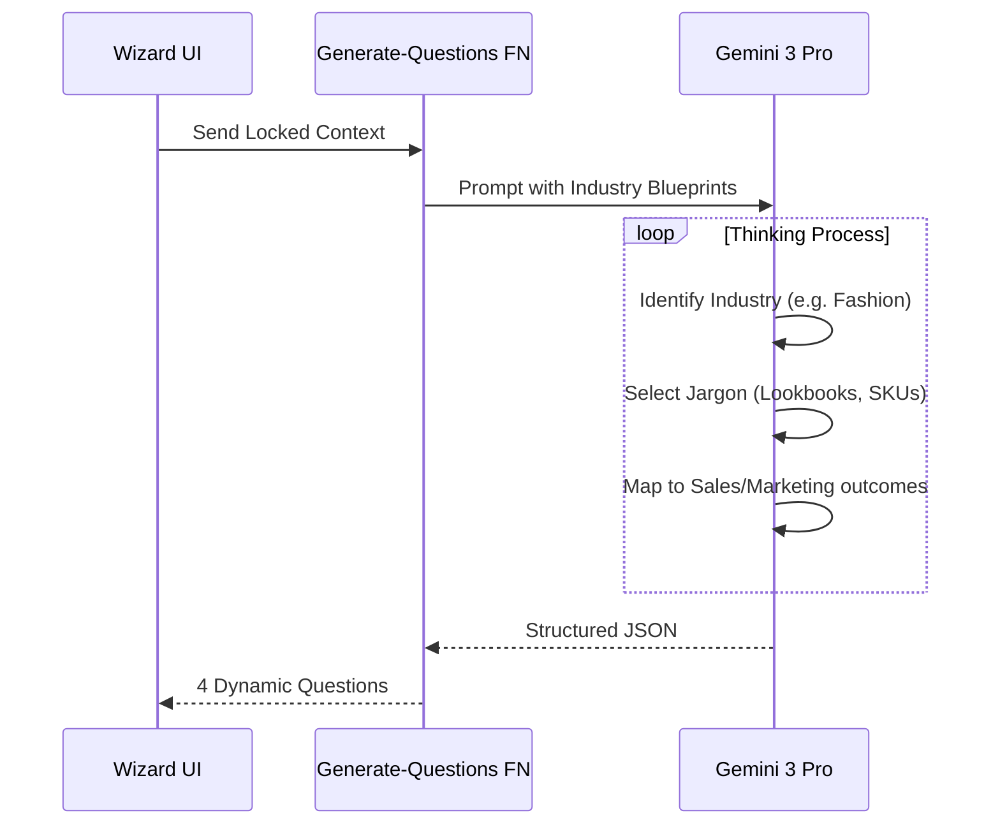
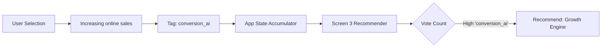

# Sun AI Agency — Screen 2 Plan: Industry Deep Dive

**Status:** Plan Approved  
**Module:** Onboarding Wizard (Step 2)  
**Role:** Senior AI Consultant

---

## 1. Executive Summary

Screen 2 is the "Consultant" phase. It takes the **Locked Business Context** from Screen 1 and generates **4 highly specific diagnostic questions**.

**Core Philosophy:**
*   **No Generic Questions:** Never ask "How is your marketing?". Ask "How quickly can you launch a new collection?" (Fashion) or "How long does it take to follow up on a Zillow lead?" (Real Estate).
*   **Sales & Growth Focus:** Questions must target Revenue, Online Sales, Social Following, and Content Speed.
*   **Deterministic Mapping:** Every answer selected here acts as a "vote" for a specific AI System in Screen 3.

---

## 2. UI Plan (User Experience)

### Screen Title Logic (Dynamic)
The title must reflect the industry immediately.
*   **Fashion:** "Where is your operation slowing down growth?"
*   **Real Estate:** "Where are deals getting stuck or delayed?"
*   **SaaS/Tech:** "What is limiting your ARR growth?"
*   **General:** "Let’s identify what is holding the business back."

### Section 1 — Business Focus (Revenue Drivers)
**Goal:** Identify the primary growth lever.
**Question:** "Which area is currently your biggest barrier to increasing revenue?"
**Industry-Specific Options (Examples):**

| Industry | Option 1 | Option 2 | Option 3 | Option 4 |
| :--- | :--- | :--- | :--- | :--- |
| **Fashion** | "Increasing online sales & conversion" | "Growing social media following" | "Launching collections faster" | "Managing inventory & returns" |
| **Real Estate** | "Generating more buyer/seller leads" | "Speed-to-lead & follow up" | "Marketing listings effectively" | "Transaction coordination" |
| **Agency** | "Getting more qualified leads" | "Closing proposals faster" | "Client reporting & retention" | "Hiring & resourcing" |

*Helper Text:* "We prioritize systems that directly attack this revenue blocker."

### Section 2 — Operational Friction (The "Grind")
**Goal:** Identify where humans waste time.
**Question:** "Where does your team spend the most manual effort today?"
**Options Pattern:**
*   "Manually [Action] [Object] in [System]"
*   *Fashion Ex:* "Manually tagging products and updating Shopify."
*   *Fashion Ex:* "Answering 'Where is my order?' emails."
*   *Real Estate Ex:* "Manually entering data into the CRM."

*Helper Text:* "This identifies where Automation Agents can reclaim hours."

### Section 3 — Speed to Execution (Velocity)
**Goal:** Quantify the cost of slowness.
**Question:** "How long does it typically take to [Key Industry Action]?"
**Dynamic Key Actions:**
*   *Fashion:* "...launch a new creative campaign?"
*   *Real Estate:* "...respond to a new inquiry?"
*   *SaaS:* "...onboard a new customer?"

**Options:**
1.  "Extremely Fast (Hours)"
2.  "Moderate (Days)"
3.  "Slow (Weeks)"
4.  "Too Slow (It hurts sales)"

*Helper Text:* "AI accelerates this specific workflow."

### Section 4 — Priority (The "North Star")
**Goal:** Force a strategic choice.
**Question:** "If you could fix one thing immediately, what would create the biggest impact?"
**Options:**
1.  "Automate repetitive tasks to save costs"
2.  "Generate and nurture more leads"
3.  "Improve customer experience & brand"
4.  "Centralize data for better decisions"

---

## 3. Answer Mapping Logic (The Brain)

Every option selected in the UI carries invisible metadata tags used by Screen 3.

**Schema:**
```typescript
interface OptionMetadata {
  text: string;           // Display text
  pain_tag: string;       // e.g. "low_conversion", "slow_content"
  impact_area: string;    // "Revenue", "Cost", "Time"
  system_hint: string;    // The specific system this votes for
}
```

**Mapping Examples:**

| Option Selected | System Hint (`system_hint`) | Target System (Screen 3) |
| :--- | :--- | :--- |
| "Increasing online sales" | `conversion_ai` | **Growth Engine** |
| "Growing social media following" | `content_scale` | **Content Architect AI** |
| "Answering customer emails" | `support_auto` | **Customer Success Agent** |
| "Manually entering data" | `data_pipeline` | **Operations Autopilot** |
| "Managing inventory" | `inventory_pred` | **Predictive Inventory** |

---

## 4. AI Agents & Orchestration

### Agent: "The Industry Consultant"
*   **Role:** Generates the Screen 2 Content.
*   **Model:** `gemini-3-pro-preview`
*   **Config:**
    *   `thinkingConfig`: Budget 2048 (Must "think" about industry nuances).
    *   `temperature`: 0.7 (Creative but structured).
    *   `tools`: NONE (Must rely on Locked Context to ensure consistency).

### Orchestration Flow
1.  **Input:** `locked_context` (JSON from Screen 1).
2.  **Prompt Assembly:** Inject `blueprints` (defined in Backend) + `locked_context`.
3.  **Generation:** Gemini generates 4 questions + 16 options.
4.  **Validation:** Edge Function ensures options map to valid `system_hints`.
5.  **Output:** JSON payload sent to Frontend.

---

## 5. Gemini 3 Implementation Details

### Prompt Engineering Strategy
We use **Blueprint Injection**. The prompt will contain "Archetypes" for common industries.

**Prompt Snippet (Concept):**
```text
You are a Senior Consultant.
CONTEXT: Industry is "Fashion Retail".

INSTRUCTIONS:
Generate 4 questions.
For Question 1 (Business Focus), options MUST include:
- "Increasing online sales"
- "Growing social media following"
- "Content generation speed"

For Question 2 (Friction), focus on "Returns", "Inventory", or "Customer Support".

For generic industries, fall back to "Revenue", "Leads", "Efficiency".
```

### JSON Schema (Strict)
```json
{
  "type": "object",
  "properties": {
    "screenTitle": { "type": "string" },
    "sections": {
      "type": "array",
      "items": {
        "question": { "type": "string" },
        "options": {
          "type": "array",
          "items": {
             "text": { "type": "string" },
             "system_hint": { "type": "string" }
          }
        },
        "helperText": { "type": "string" }
      }
    }
  }
}
```

---

## 6. Mermaid Diagrams

### Sequence: Generation


### Flowchart: Data Mapping


---

## 7. Success Criteria & Testing

### Success Criteria
1.  **Specificity:** If Industry is "Fashion", the word "Inventory" or "Collection" MUST appear.
2.  **Relevance:** Questions must prioritize **Revenue/Sales** over generic "IT issues".
3.  **Mapping:** Every generated option must have a valid `system_hint` that exists in the System Catalog.
4.  **Tone:** Must read like a human consultant (Short, punchy, business-first).

### QA Test Cases
*   **Case A (Fashion):** Expect options about "Social Media", "Online Sales", "Returns".
*   **Case B (Real Estate):** Expect options about "Leads", "Follow-up", "Listings".
*   **Case C (Generic/Other):** Expect options about "Leads", "Manual Data", "Efficiency".

---

## 8. Production Checklist

- [ ] **Edge Function:** `generate-questions` updated with specific Blueprints for Fashion/Retail/Real Estate.
- [ ] **Prompt:** Updated to explicitly request "social media" and "online sales" options for B2C/Retail.
- [ ] **Schema:** Zod validation added to ensure `system_hint` is snake_case.
- [ ] **Fallback:** Hardcoded fallback JSON exists if Gemini fails (prevent white screen).
- [ ] **Loading State:** "Consultant is analyzing your business model..." message active.
