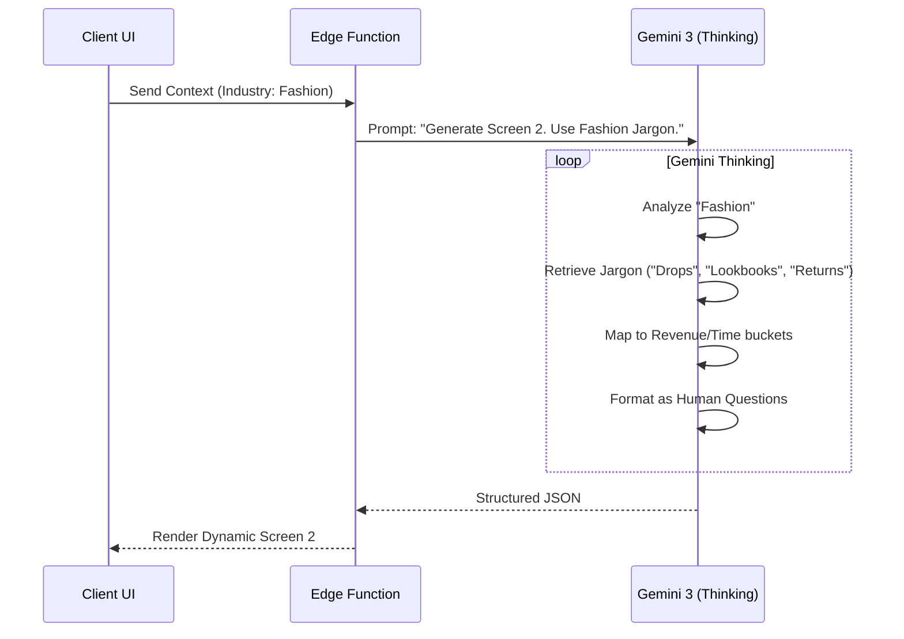

# Sun AI Agency — Screens 1 & 2 Refactor Plan (The "Consultant" Upgrade)

**Version:** 2.1 (Audit-Verified & Corrected)  
**Status:** Approved for Implementation  
**Focus:** Converting "Form Filling" into "Active Consulting"

---

## 1. Executive Summary

We are redesigning the first two steps of the wizard. The previous version was functionally correct (AI worked) but emotionally generic (felt like a form).

**The Goal:** The user must feel like they are speaking to a Senior Industry Consultant, not a chatbot.
**The Method:**
1.  **Screen 1:** Use **Search Grounding** to instantly "know" the user.
2.  **Screen 2:** Use **Gemini Thinking** to speak their specific industry language (no generic "bottlenecks").

---

## 2. Gemini 3 Tools & Features Matrix

Here is how specific Gemini 3 capabilities are utilized in this refactor:

| Gemini 3 Feature | Status | Application in Screens 1 & 2 |
| :--- | :--- | :--- |
| **Text Generation** | ✅ Core | Generating the dynamic questions and "Consultant Explanations" in the right panel. |
| **Gemini Thinking** | ✅ **CRITICAL** | Used in **Screen 2 generation**. The model is given a `thinkingBudget` to analyze the Industry Profile and map generic concepts (e.g., "Operations") to specific jargon (e.g., "Returns Management" for Fashion). |
| **Structured Outputs** | ✅ **CRITICAL** | Used in **Both Screens**. Enforces strict JSON schemas so the UI renders perfectly (Dropdowns, Multi-selects) without parsing errors. |
| **Grounding (Google Search)** | ✅ **CRITICAL** | Used in **Screen 1**. The AI *must* Google the company name to verify existence, industry, and business model. This creates the "Magic Moment" of recognition. |
| **URL Analysis** | ✅ **VERIFIED** | **Correction:** We do not use a separate `urlContext` tool (not available in standard SDK). Instead, we use **Google Search** targeted at the specific URL (e.g., searching for "About Us" and "Pricing" pages) to extract context. |
| **Function Calling** | ⚠️ Indirect | We use the `googleSearch` tool, which is a specialized function call. We do not use arbitrary function calling (e.g., external APIs) in this phase. |
| **Code Execution** | ❌ Not Used | No data analysis or Python execution required for this qualitative phase. |
| **Interactions API** | ❌ Not Used | This is a text/UI-based wizard, not a real-time voice/video session. |
| **Deep Research** | ⚠️ Lite | Screen 1 performs "Lite" research (1-2 queries). Full "Deep Research" is reserved for the paid Strategy Report generation (Phase 2). |

---

## 3. Screen 1 Refactor: The Foundation

### Logic Update
We must ensure the **Industry Detection** is specific, not generic.
*   *Old:* "Retail"
*   *New:* "Fashion Retail" or "Home Goods E-commerce"

### UI Behavior
*   **Input:** Company Name + URL.
*   **Loading State Text:** 
    1. "Reading your website..."
    2. "Analyzing business model..."
    3. "Verifying industry context..."
*   **Output:** A **Locked Context** object that drives Screen 2.

### Edge Function: `analyze-business` (Update)
*   **Tool Usage:** Enable `googleSearch`.
*   **Prompt Strategy:** Explicitly instruct the model to search for the company's "About Us" page to determine the *exact* niche.
*   **Constraint:** "Do not return generic industries. Be specific. If the website sells clothes, return 'Fashion Retail', not just 'Retail'."

---

## 4. Screen 2 Refactor: Industry Deep Dive

This is the massive overhaul. We are replacing generic tech-speak with specific business outcomes.

### Dynamic UI Copy Logic

The **Screen Title** and **Questions** must change based on the `detectedIndustry` from Screen 1.

#### A. Screen Title (Dynamic Implementation)

**Correction:** This logic must be implemented in the **Frontend (`Wizard.tsx`)**, not just backend data.

| Detected Industry | Display Title |
| :--- | :--- |
| **Fashion / E-com** | "What’s slowing down your sales and content growth?" |
| **Real Estate** | "Where are deals getting stuck or delayed?" |
| **Travel / Hosp** | "What’s limiting bookings and operational scale?" |
| **Agency / Services** | "What’s holding your growth back right now?" |
| **Other / General** | "What is the biggest barrier to growing your business?" |

*Subtitle (All):* "Let’s pinpoint the biggest issues so we can fix the right things first."

#### B. Section 1: Sales & Growth (The "Money" Question)

**Question:** "Which area is currently the biggest blocker to growing your business?"

*Gemini Thinking Instruction:* "Generate 4 options. They must be outcome-oriented."

*   **Fashion/Ecom:**
    1.  Increasing online sales and conversions (`system_hint: conversion_ai`)
    2.  Growing social media following and engagement (`system_hint: content_scale`)
    3.  Creating content fast enough (`system_hint: creative_auto`)
    4.  Managing inventory, sell-through, and returns (`system_hint: inventory_pred`)
*   **Real Estate:**
    1.  Getting more buyer or seller leads (`system_hint: lead_gen`)
    2.  Following up with leads fast enough (`system_hint: speed_lead`)
    3.  Marketing listings so they get attention (`system_hint: listing_marketing`)
    4.  Managing deals, documents, and coordination (`system_hint: trans_coord`)
*   **Services/Agency:**
    1.  Getting more qualified leads (`system_hint: lead_gen`)
    2.  Closing proposals faster (`system_hint: sales_closer`)
    3.  Delivering work efficiently without burnout (`system_hint: ops_auto`)
    4.  Retaining clients and growing accounts (`system_hint: client_success`)

#### C. Section 2: Operational Friction (The "Time" Question)

**Question:** "Where does your team spend the most time on repetitive or manual work?"

*   **Universal Options (Contextually phrased):**
    1.  Answering the same customer questions repeatedly (`system_hint: support_ai`)
    2.  Copying information between tools or spreadsheets (`system_hint: data_pipeline`)
    3.  Creating reports, updates, or content manually (`system_hint: reporting_auto`)
    4.  Searching for files, messages, or past information (`system_hint: knowledge_base`)

#### D. Section 3: Speed (The "Velocity" Question)

**Question:** "How long does it usually take to [Key Industry Action]?"

*   *Fashion:* "...launch a campaign or drop"
*   *Real Estate:* "...respond to a new inquiry"
*   *Agency:* "...deliver proposals or client updates"

*   **Options:**
    1.  Same day
    2.  1–7 days
    3.  1–4 weeks
    4.  More than a month

#### E. Section 4: Priority (The "North Star")

**Question:** "If you could fix just one thing right now, what would help the most?"

*   **Options:**
    1.  Generate more leads or sales
    2.  Save time by automating repetitive work
    3.  Improve customer experience and communication
    4.  Get clearer visibility into what’s working

---

## 5. Technical Implementation Plan (Corrected)

### Step 1: Update Edge Function `generate-questions`
*   **Prompt Engineering:** Inject the specific copy templates above into the prompt.
*   **Thinking Config:** Set `thinkingBudget: 2048`.
*   **Tone Constraint (CRITICAL):**
    *   *Instruction:* "You are a Senior Industry Consultant speaking to a business owner."
    *   *Negative Constraint:* "Never use words like 'bottleneck', 'friction', 'optimization', 'leverage', or 'interface' in the question text."
    *   *Positive Constraint:* "Use words like 'Sales', 'Time', 'Growth', 'Revenue', 'Customers'."

### Step 2: Update Frontend UI `Wizard.tsx`
*   **Dynamic Header Logic:**
    ```typescript
    const getHeaderContent = () => {
      if (step === 2) {
        const ind = analysis?.detectedIndustry?.toLowerCase() || '';
        if (ind.includes('fashion') || ind.includes('retail')) return { title: "What’s slowing down your sales...?", ... };
        if (ind.includes('real estate')) return { title: "Where are deals getting stuck...?", ... };
        // ... default fallback
      }
    }
    ```
*   **Helper Text:** Add the specific "Why we ask this" text below each question (collapsible or small text).

### Step 3: Data Mapping (The Invisible Layer)
We must ensure the new "Human" options map to the old "System" logic.

*   *User clicks:* "Growing social media following"
*   *System sees:* `pain_tag: content_scale` -> **Recommend System: Content Architect AI**

*   *User clicks:* "Copying information between tools"
*   *System sees:* `pain_tag: ops_data_entry` -> **Recommend System: Operations Autopilot**

---

## 6. Mermaid Flow: The "Thinking" Process



## 7. Success Criteria

1.  **No "AI-Speak":** The words "optimization", "friction", "leverage", and "interface" do not appear on Screen 2.
2.  **Industry Recognition:** A Real Estate agent sees the word "Listings". A Fashion brand sees "Collections".
3.  **Perfect Mapping:** Selecting "Leads" in Screen 2 guarantees the "Growth Engine" system appears in Screen 3.
