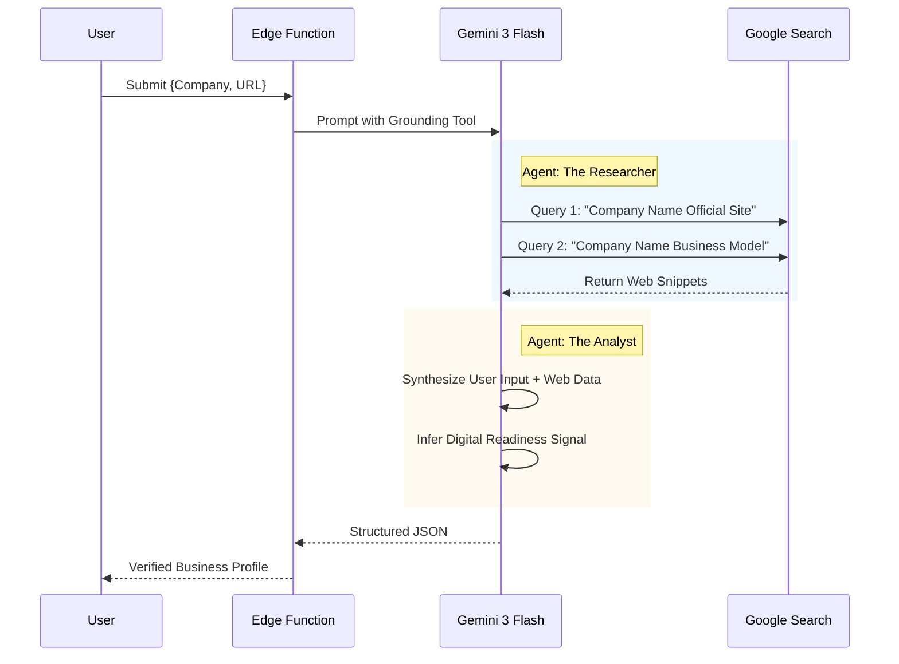

# analyzeBusiness

**Service Function:** `analyzeBusiness(profile: BusinessProfile)`  
**Edge Function:** `analyze-business`

## Executive Summary

| Feature | Description |
| :--- | :--- |
| **Core Capability** | Real-time Entity Verification & Business Profiling |
| **AI Agent** | **The Researcher & The Analyst** (Dual-Agent Workflow) |
| **Gemini 3 Model** | `gemini-3-flash-preview` (Optimized for Latency & Search) |
| **Key Tools** | Google Search Grounding, URL Context Extraction |
| **Business Outcome** | Instant trust; the user feels "known" without manual data entry. |

## Purpose
Establishes the "Data Foundation" for the session. It validates the user's input against real-time web data to create a verified business profile. This replaces manual research and builds immediate trust by showing the user that the AI "knows" them.

## Workflow Logic (Mermaid)



## Gemini 3 Configuration & Logic

### Models & Tools
*   **Model:** `gemini-3-flash-preview`
    *   *Reasoning:* We prioritize speed (low latency) for this first interaction to prevent drop-off, while leveraging the model's native ability to handle search tool calls effectively.
*   **Tools:** `googleSearch`
    *   *Usage:* The model is explicitly instructed to extract the "Truth" from the web if the user's description is vague.
*   **Structured Output:** `responseMimeType: "application/json"` with a strict Schema.

### Logic & Agents
1.  **The Researcher (Core):** Takes the `website_url` and verifies if the domain is active. If no URL is provided, it searches the `company_name` to find a likely match.
2.  **The Analyst (Advanced):** Looks for "Digital Signals".
    *   *Example:* If the search result mentions "Shopify", the Analyst infers `digitalReadiness: High` for e-commerce.
    *   *Example:* If the site has no SSL or mobile view, it infers `digitalReadiness: Low`.

## Inputs & Outputs

**Input Payload:**
```json
{
  "company_name": "Acme Inc.",
  "website_url": "https://acme.com",
  "industry_hint": "E-Commerce",
  "description": "We sell organic dog food..."
}
```

**Output Schema (BusinessAnalysis):**
```json
{
  "detectedIndustry": "Pet Care Retail",
  "businessModel": "DTC", 
  "digitalReadiness": "Medium",
  "observations": [
    "Strong social media presence detected via Instagram links.",
    "Uses Shopify for e-commerce infrastructure.",
    "Recent news indicates expansion into cat products."
  ]
}
```

## Real World Examples
*   **Scenario A:** User enters "Stripe" but describes it as "A bank".
    *   *AI Result:* Corrects industry to "Fintech / Payment Infrastructure" based on Search Grounding.
*   **Scenario B:** User enters a local bakery with no website.
    *   *AI Result:* Detects "Brick & Mortar" model and "Low" digital readiness, tailoring future advice to basic digitization.
