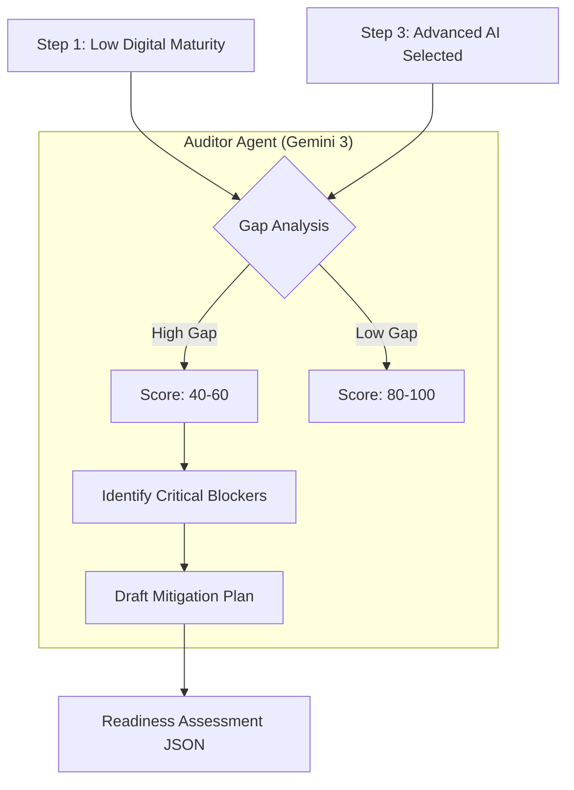

# assessReadiness

**Service Function:** `assessReadiness(profile: BusinessProfile, systems: string[])`  
**Edge Function:** `assess-readiness`

## Executive Summary

| Feature | Description |
| :--- | :--- |
| **Core Capability** | Risk Assessment & Gap Analysis |
| **AI Agent** | **The Risk Auditor** |
| **Gemini 3 Model** | `gemini-3-pro-preview` (Critical Reasoning) |
| **Key Config** | **Thinking Config** (`thinkingBudget: 4096`) |
| **Business Outcome** | Managed expectations; prevents project failure by flagging prerequisites. |

## Purpose
Acts as the "Auditor". It performs a reality check to see if the client's current maturity (from Step 1) matches the requirements of the selected systems (from Step 3). It builds trust by identifying valid risks before implementation starts.

## Workflow Logic (Mermaid)



## Gemini 3 Configuration & Logic

### Models & Config
*   **Model:** `gemini-3-pro-preview`
    *   *Reasoning:* This requires "Critical" thinking. The model must resist the urge to be "agreeable" (RLHF bias) and instead be honest about risks.
*   **Thinking Config:** `thinkingBudget: 4096`
    *   *Usage:* A high thinking budget is used to simulate a rigorous audit. The model iterates through Tech, Process, Data, and Team dimensions to find weak points.

### Logic & Agents
1.  **The Auditor (Core):** Calculates a weighted score (0-100).
2.  **The Gap Detector (Advanced):**
    *   *Logic:* If `System == "Predictive Analytics"` AND `DigitalReadiness == "Low"`, THEN `CriticalGap = "Lack of structured historical data"`.

## Inputs & Outputs

**Input Payload:**
```json
{
  "profile": { "digitalReadiness": "Low", "description": "We use paper ledgers." },
  "systems": ["Predictive Inventory AI"]
}
```

**Output Schema (ReadinessAssessment):**
```json
{
  "score": 45,
  "breakdown": {
    "tech": 30,
    "process": 50,
    "data": 20,
    "team": 80
  },
  "criticalGaps": [
    "Predictive AI requires digital data; current paper ledgers are incompatible."
  ],
  "quickWins": [
    "Digitize last 3 months of ledgers into CSV format."
  ]
}
```

## Real World Examples
*   **High Risk:** A solo founder wants "Full Autonomous Enterprise". Score: 30. (Gap: "Team Bandwidth").
*   **Low Risk:** A Shopify Plus brand wants "Email Marketing AI". Score: 92. (Ready to launch).
