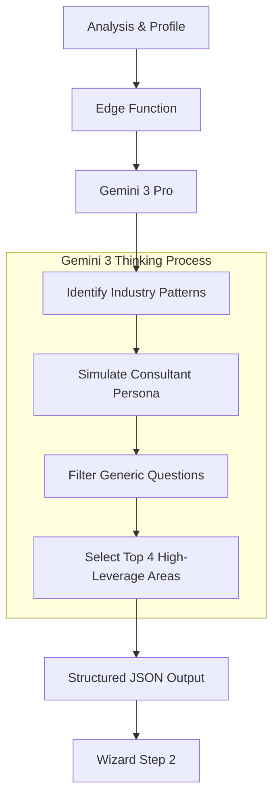

# generateQuestions

**Service Function:** `generateQuestions(analysis: BusinessAnalysis, profile: BusinessProfile)`  
**Edge Function:** `generate-questions`

## Executive Summary

| Feature | Description |
| :--- | :--- |
| **Core Capability** | Dynamic Discovery & Bottleneck Diagnosis |
| **AI Agent** | **The Senior Consultant** |
| **Gemini 3 Model** | `gemini-3-pro-preview` (Reasoning & Nuance) |
| **Key Config** | **Thinking Config** (`thinkingBudget: 2048`) |
| **Business Outcome** | High-value problem identification; filters out "noise" questions. |

## Purpose
Acts as the "Senior Consultant". Instead of asking generic questions, it uses the analyzed industry context to generate 4 highly specific bottleneck questions. This filters noise and focuses on high-value business problems (Revenue, Cost, Speed).

## Workflow Logic (Mermaid)



## Gemini 3 Configuration & Logic

### Models & Config
*   **Model:** `gemini-3-pro-preview`
    *   *Reasoning:* We need high intelligence to simulate a *Senior* Consultant. The questions must sound experienced, not robotic.
*   **Thinking Config:** `thinkingBudget: 2048`
    *   *Usage:* The model is given a budget to "think" about the specific constraints of the user's industry before generating the questions. This prevents generic "How is your marketing?" questions and produces specific "How is your ROAS on Meta?" questions.
*   **Context Window:** The entire `BusinessAnalysis` object from Step 1 is injected into the context.

### Logic & Agents
1.  **The Consultant (Core):** Analyzes the `detectedIndustry` and `businessModel`.
2.  **The Filter (Advanced):** The agent explicitly rejects questions that are "Operational Noise" (e.g., "Is your printer working?") and prioritizes "Strategic Blockers" (e.g., "Is your CAC sustainable?").

## Inputs & Outputs

**Input Payload:**
```json
{
  "analysis": {
    "detectedIndustry": "SaaS",
    "businessModel": "B2B",
    "observations": ["High ticket sales", "Long sales cycle"]
  },
  "profile": { "description": "Enterprise CRM software" }
}
```

**Output Schema (BottleneckQuestion[]):**
```json
[
  {
    "id": "q1",
    "category": "Business Focus",
    "text": "What is the primary cause of deal slippage in your pipeline?",
    "rationale": "Enterprise SaaS companies often lose revenue to long decision cycles.",
    "type": "single",
    "options": ["Stalled stakeholders", "Budget freeze", "Technical compliance"]
  }
]
```

## Real World Examples
*   **Industry: Legal Services**
    *   *Question:* "How much billable time is lost to non-billable admin work?" (Focus: Efficiency)
*   **Industry: E-Commerce**
    *   *Question:* "What is your primary constraint in scaling ad spend?" (Focus: Unit Economics)
