# generateStrategy

**Service Function:** `generateStrategy(profile: BusinessProfile, systems: string[])`  
**Edge Function:** `generate-strategy`

## Executive Summary

| Feature | Description |
| :--- | :--- |
| **Core Capability** | Project Planning & Roadmap Generation |
| **AI Agent** | **The Project Strategist** |
| **Gemini 3 Model** | `gemini-3-pro-preview` |
| **Key Workflow** | Temporal Planning & Dependency Management |
| **Business Outcome** | A signed 90-day execution roadmap (Phase 1/2/3). |

## Purpose
Acts as the "Project Manager". It synthesizes all previous steps into a 3-phase execution roadmap. It converts abstract system selection into a concrete timeline with deliverables, ensuring dependencies are respected (e.g., "Build Foundation" before "Scale").

## Workflow Logic (Mermaid)

```mermaid
gantt
    title Gemini 3 Generated Roadmap Logic
    dateFormat X
    axisFormat %w
    
    section Logic Flow
    Analyze Inputs       :done,    des1, 0, 1
    Determine Phases     :active,  des2, 1, 2
    Assign Deliverables  :         des3, 2, 3
    
    section Output (Example)
    Phase 1: Foundation  :         p1, 0, 4
    Phase 2: Automation  :         p2, 4, 8
    Phase 3: Scale       :         p3, 8, 12
```



## Gemini 3 Configuration & Logic

### Models & Config
*   **Model:** `gemini-3-pro-preview`
    *   *Reasoning:* Requires "Long-Horizon Planning". The model must understand cause-and-effect relationships over time (Temporal Reasoning).
*   **Context:** All accumulated state (Profile, Questions, Systems, Readiness) is passed to ensure the plan addresses the specific risks found in Step 4.

### Logic & Agents
1.  **The Strategist (Core):** Divides the selected systems into 3 phases.
    *   *Phase 1 (Foundation):* Setup, Data cleaning, Integration.
    *   *Phase 2 (Implementation):* Launching the core agents.
    *   *Phase 3 (Optimization):* Refinement and scaling.
2.  **The Scheduler (Advanced):** Estimates `timelineWeeks` based on the complexity of the systems.
    *   *Logic:* If `System == "Custom LLM"`, add +2 weeks to Phase 1.

## Inputs & Outputs

**Input Payload:**
```json
{
  "profile": { ... },
  "systems": ["Customer Support Agent"],
  "readiness": { "criticalGaps": ["No Knowledge Base"] }
}
```

**Output Schema (StrategyPhase[]):**
```json
[
  {
    "phase": 1,
    "name": "Knowledge Foundation",
    "description": "Before launching the agent, we must build the knowledge base it will reference.",
    "timelineWeeks": "1-3",
    "deliverables": ["Scrape website FAQs", "Upload PDF Manuals", "Define Tone of Voice"]
  },
  {
    "phase": 2,
    "name": "Agent Deployment",
    "description": "Live launch of the support agent on the website.",
    "timelineWeeks": "4-6",
    "deliverables": ["Widget Integration", "Testing Sandbox", "Go-Live"]
  }
]
```

## Real World Examples
*   **Fast Track:** Client is "High Readiness". Plan is aggressive (4 weeks total).
*   **Remediation Track:** Client has "Critical Data Gaps". Phase 1 is entirely focused on "Data Structuring" before any AI is touched.
