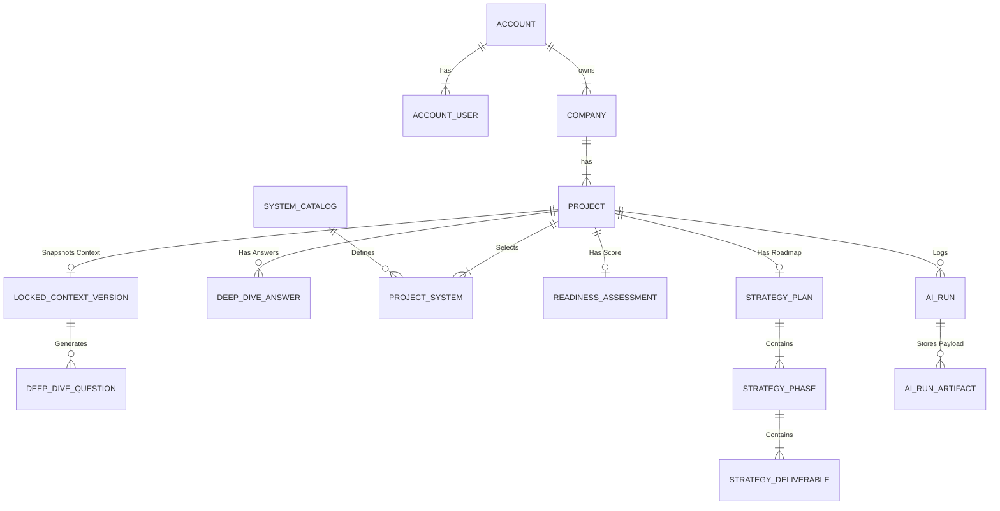
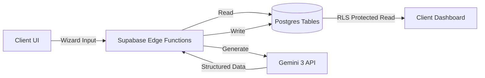

# Sun AI Agency Platform — Supabase Backend Strategy

**Version:** 1.0  
**Status:** Architecture Specification  
**Author:** Senior AI Platform Architect

---

## 1. Overview

This document defines the production backend architecture for the Sun AI Agency Platform. The primary goals are:

1.  **Traceability:** Every AI-generated decision must be linked to the specific business context version it was based on.
2.  **Determinism:** "Business Context" (Step 1) is immutable once locked, ensuring subsequent steps (Strategy, Systems) are consistent.
3.  **Security:** Multi-tenant isolation using Row Level Security (RLS) and strict account boundaries.
4.  **Auditability:** Every interaction with Gemini 3 is logged to an `ai_runs` table for debugging and cost analysis.

### Data Lifecycle
1.  **Wizard Session:** Temporary state accumulation.
2.  **Locking:** Business Context is finalized and saved as a `locked_context_version`.
3.  **AI Execution:** Edge Functions read the *locked version* to generate insights.
4.  **Storage:** Approved strategies are persisted to `strategy_plans`.
5.  **Dashboard:** A high-performance read view of the latest approved plan.

---

## 2. Core Access & Tenancy Model

We enforce a strict 3-tier hierarchy: **Account → Company → Project**.

### 2.1 `accounts`
*The billing and administrative boundary.*
*   `id` (uuid, PK)
*   `name` (text): e.g., "Agency X"
*   `plan_tier` (text): 'free', 'pro', 'enterprise'
*   `created_at` (timestamptz)

### 2.2 `account_users`
*Links Supabase Auth Users to Accounts.*
*   `account_id` (uuid, FK)
*   `user_id` (uuid, FK -> auth.users)
*   `role` (text): 'owner', 'admin', 'editor', 'viewer'
*   **PK:** (account_id, user_id)

### 2.3 `companies`
*The business entities being analyzed.*
*   `id` (uuid, PK)
*   `account_id` (uuid, FK)
*   `name` (text)
*   `domain` (text, nullable)
*   `logo_url` (text, nullable)

### 2.4 `projects`
*A specific engagement or analysis run for a company.*
*   `id` (uuid, PK)
*   `company_id` (uuid, FK)
*   `account_id` (uuid, FK) — *Denormalized for RLS performance*
*   `name` (text): e.g., "Q1 2024 AI Strategy"
*   `status` (text): 'draft', 'active', 'archived'
*   `current_wizard_step` (int)

---

## 3. Wizard Data Model

### Screen 1 — Business Context
**Goal:** Create a trusted, immutable snapshot of the business reality.

**`locked_context_versions`**
*   `id` (uuid, PK)
*   `project_id` (uuid, FK)
*   `version` (int): Incremented automatically.
*   `context_json` (jsonb): Full snapshot of user input + AI analysis.
*   `is_active` (bool)
*   `created_at` (timestamptz)

**`ai_runs`**
*   `id` (uuid, PK)
*   `project_id` (uuid, FK)
*   `function_name` (text): e.g., 'analyze_business'
*   `model_used` (text): e.g., 'gemini-3-flash'
*   `token_usage` (int, nullable)
*   `duration_ms` (int)
*   `status` (text): 'success', 'failure'

**`ai_run_artifacts`**
*   `run_id` (uuid, FK)
*   `input_payload` (jsonb)
*   `output_payload` (jsonb)

---

### Screen 2 — Industry Deep Dive
**Goal:** Capture specific pain points mapped to business impact.

**`deep_dive_questions`**
*   `id` (uuid, PK)
*   `project_id` (uuid, FK)
*   `context_version_id` (uuid, FK) — *Links to the specific context used to generate this.*
*   `category` (text)
*   `question_text` (text)
*   `options_json` (jsonb): Array of options with system_hints.

**`deep_dive_answers`**
*   `id` (uuid, PK)
*   `question_id` (uuid, FK)
*   `project_id` (uuid, FK)
*   `selected_options` (jsonb): Array of strings.
*   `implied_pain_points` (jsonb): Extracted tags like 'high_churn', 'manual_entry'.

---

### Screen 3 — System Selection
**Goal:** Define the architectural scope.

**`system_catalog`** (Global Seed Data)
*   `id` (text, PK): e.g., 'sys_growth_engine'
*   `name` (text)
*   `category` (text)
*   `default_capabilities` (jsonb)

**`system_recommendations`**
*   `id` (uuid, PK)
*   `project_id` (uuid, FK)
*   `system_id` (text, FK)
*   `match_score` (float)
*   `reasoning` (text)

**`project_systems`** (User Selection)
*   `id` (uuid, PK)
*   `project_id` (uuid, FK)
*   `system_id` (text, FK)
*   `status` (text): 'proposed', 'approved', 'implemented'

---

### Screen 4 — Readiness Assessment
**Goal:** Quantify risk.

**`readiness_assessments`**
*   `id` (uuid, PK)
*   `project_id` (uuid, FK)
*   `overall_score` (int): 0-100
*   `breakdown_json` (jsonb): `{ tech: 50, team: 80, process: 30 }`
*   `critical_gaps` (jsonb): Array of strings.
*   `quick_wins` (jsonb): Array of strings.
*   `created_at` (timestamptz)

---

### Screen 5 — Strategy Generation
**Goal:** The final roadmap product.

**`strategy_plans`**
*   `id` (uuid, PK)
*   `project_id` (uuid, FK)
*   `version` (int)
*   `is_active` (bool)
*   `created_at` (timestamptz)

**`strategy_phases`**
*   `id` (uuid, PK)
*   `plan_id` (uuid, FK)
*   `phase_number` (int)
*   `name` (text)
*   `description` (text)
*   `timeline_weeks` (text)

**`strategy_deliverables`**
*   `id` (uuid, PK)
*   `phase_id` (uuid, FK)
*   `description` (text)
*   `owner_role` (text): 'AI', 'Human', 'Client'
*   `status` (text): 'pending', 'in_progress', 'done'

---

### Dashboard Support
**`project_events`** (Audit Log)
*   `id` (uuid, PK)
*   `project_id` (uuid, FK)
*   `event_type` (text): 'context_locked', 'strategy_approved', 'deliverable_completed'
*   `metadata` (jsonb)
*   `created_by` (uuid, FK -> auth.users)

---

## 4. Relationships + ERD

### Entity Relationship Diagram



### Data Flow



---

## 5. RLS Policies

All tables must have RLS enabled.

**General Policy Pattern:**
```sql
-- "User can view rows if they belong to the same account"
create policy "Account Isolation"
on public.projects
for all
using (
  account_id in (
    select account_id from public.account_users
    where user_id = auth.uid()
  )
);
```

### Specific Rules

1.  **`locked_context_versions`**:
    *   **INSERT:** Allowed for Editors/Admins.
    *   **UPDATE:** **FORBIDDEN**. (Immutability enforced).
    *   **DELETE:** Admins only.

2.  **`ai_runs`**:
    *   **INSERT:** Service Role ONLY (Edge Functions).
    *   **SELECT:** Admins/Developers (for debugging).

3.  **`strategy_plans`**:
    *   **SELECT:** All Project Members.
    *   **UPDATE:** Editors/Admins only.

---

## 6. Indexes & Performance

### Foreign Keys
Create B-Tree indexes on all foreign keys to prevent locking issues and speed up joins.
*   `idx_projects_account_id`
*   `idx_projects_company_id`
*   `idx_context_project_id`

### JSONB GIN Indexes
For querying inside JSON payloads (e.g., finding all projects with "Low" digital readiness).
*   `idx_context_json` on `locked_context_versions(context_json)`
*   `idx_readiness_gaps` on `readiness_assessments(critical_gaps)`

### Dashboard Queries
Top queries to optimize:
1.  **"Get Latest Strategy"**: `SELECT * FROM strategy_plans WHERE project_id = ? ORDER BY version DESC LIMIT 1`
    *   Index: `idx_strategy_project_version`

---

## 7. Triggers & Database Functions

### `update_updated_at`
Standard trigger for all mutable tables.

### `enforce_context_immutability`
Trigger BEFORE UPDATE on `locked_context_versions`.
*   Raise exception "Context versions are immutable. Create a new version instead."

### Helper Functions (RPC)

**`get_project_summary(p_id uuid)`**
Returns a JSON object containing the latest Context, Score, and Strategy Plan for a given project. Reduces round-trips for the dashboard load.

```sql
create function get_project_summary(p_id uuid)
returns json as $$
  -- joins context, readiness, strategy
$$ language sql stable;
```

---

## 8. Edge Functions (Wizard + AI)

All functions reside in `/supabase/functions`.
Authentication: `Authorization: Bearer <anon_key>` + `x-client-info`.

### 8.1 `analyze_business`
*   **Purpose:** Step 1 Analysis.
*   **Input:** `{ company_name, url, description }`
*   **Gemini:** `gemini-3-flash` + Google Search Tool.
*   **Write:** Creates `ai_run`.
*   **Return:** JSON Analysis (Client saves to `locked_context_versions`).

### 8.2 `generate_deep_dive_questions`
*   **Purpose:** Step 2.
*   **Input:** `{ context_version_id }`
*   **Gemini:** `gemini-3-pro` + Thinking (2048).
*   **Read:** Fetches `locked_context_versions`.
*   **Return:** Array of Questions.

### 8.3 `recommend_systems`
*   **Purpose:** Step 3.
*   **Input:** `{ answers_payload }`
*   **Gemini:** `gemini-3-pro`.
*   **Return:** Recommended Systems list.

### 8.4 `assess_readiness`
*   **Purpose:** Step 4.
*   **Input:** `{ context_version_id, selected_systems }`
*   **Gemini:** `gemini-3-pro` + Thinking (4096).
*   **Return:** Score + Gaps.

### 8.5 `generate_strategy`
*   **Purpose:** Step 5.
*   **Input:** `{ readiness_id }`
*   **Gemini:** `gemini-3-pro` (Planning).
*   **Return:** Full Roadmap (Phases/Deliverables).

---

## 9. AI Agents & Workflows

| Agent | Screen | Logic | Gemini Features |
| :--- | :--- | :--- | :--- |
| **Researcher** | 1 | Verifies entity existence. | Search Grounding |
| **Analyst** | 1 | Profiles business model. | JSON Schema |
| **Consultant** | 2 | Generates specific questions. | Thinking Mode |
| **Architect** | 3 | Maps pain to systems. | Reasoning |
| **Auditor** | 4 | Finds critical gaps. | Thinking Mode (High) |
| **Strategist** | 5 | Plans temporal roadmap. | Planning |

**Workflow Orchestration:**
The Frontend (React) acts as the orchestrator for the Wizard, calling Edge Functions in sequence. The State is persisted to Postgres after each step.

---

## 10. Gemini 3 Features & Tools Usage

### Google Search Grounding
*   **Usage:** EXCLUSIVELY in `analyze_business` (Step 1).
*   **Constraint:** Do not use search in later steps to ensure determinism based on the "Locked Context".

### Thinking Mode (Budgeting)
*   **Step 2 (Questions):** `budget: 2048`. Needs nuance but not deep logic.
*   **Step 4 (Readiness):** `budget: 4096`. Needs rigorous "Red Teaming" to find risks.

### Structured JSON
*   **Usage:** 100% of outputs.
*   **Validation:** Use Zod in Edge Functions to validate Gemini output before writing to DB.

---

## 11. Security & Secrets

1.  **API Keys:** `GOOGLE_API_KEY` stored in Supabase Vault / Secrets. NEVER exposed to client.
2.  **Service Role:** Edge Functions use Service Role for `ai_runs` logging (bypass RLS), but use User Context for business data (respect RLS).
3.  **Rate Limiting:** Implement Upstash/Redis rate limiting in Edge Functions (e.g., 10 AI calls/min/user).

---

## 12. Migration & Seed Plan

1.  **Migration 01:** Enable UUID extension.
2.  **Migration 02:** Create `accounts`, `users`, `companies`.
3.  **Migration 03:** Create Wizard tables (`context`, `questions`, `systems`).
4.  **Seed:** Populate `system_catalog` with the 20+ base AI systems (Growth Engine, Content AI, etc.).

---

## 13. Production Checklist

- [ ] RLS policies enabled on ALL tables (no `public` access).
- [ ] `anon` role has ZERO permission to read tables directly (must use RPC or Edge Functions if logic is complex, though direct RLS read is fine for dashboard).
- [ ] `locked_context_versions` is immutable via trigger.
- [ ] Gemini API Key is set in Supabase Secrets.
- [ ] Dashboard queries use indexes.
- [ ] AI Runs are logging successfully.
